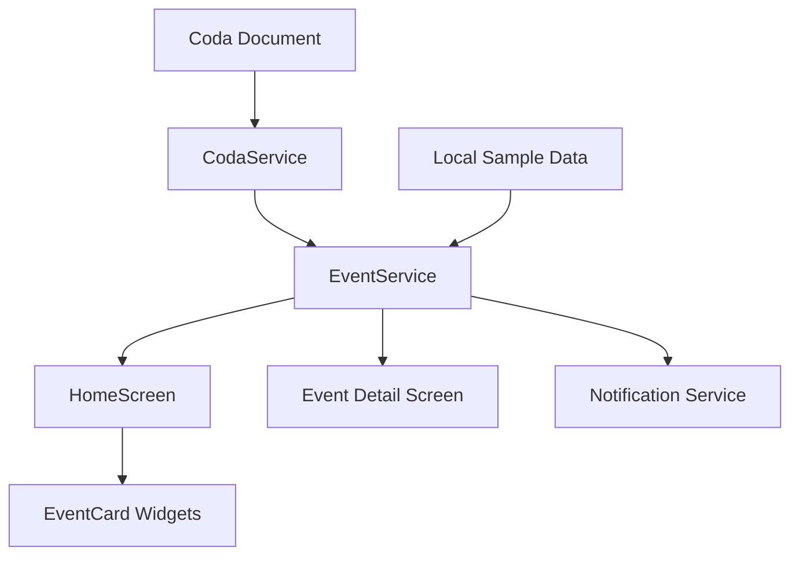

# Gatherings - Event Notifications App

A modern Flutter application for managing and viewing events with beautiful card designs and notification capabilities. Originally created for C2C+NoC and enhanced with Coda integration.

## Features

- **Event Discovery**: Browse events with beautiful card-based UI
- **Smart Notifications**: Get notified before events start
- **Categories & Search**: Filter events by category and search
- **Live Preview**: Hot reload for rapid development
- **Coda Integration**: Connect to Coda documents for dynamic event data (Web only)
- **Cross-platform**: Runs on iOS, Android, and Web
- **Auto-fallback**: Seamlessly switches between live and sample data

## Quick Start

### Prerequisites

- Flutter SDK (3.32.7 or later)
- VS Code with Flutter extension
- Chrome browser (for web preview)

### Setup

1. **Clone and Navigate**
   ```bash
   cd /path/to/EventsApp/C2CNoCEvents
   ```

2. **Install Dependencies**
   ```bash
   flutter pub get
   ```

3. **Run Web Preview**
   ```bash
   flutter run -d chrome --web-port 3000
   ```

### VS Code Tasks

The project includes pre-configured VS Code tasks:

- **Flutter: Run Web (Live Preview)** - Start development server on port 3000
- **Flutter: Get Dependencies** - Install/update packages
- **Flutter: Clean** - Clean build artifacts
- **Flutter: Run iOS Simulator** - Run on iOS simulator
- **Flutter: Run Android Emulator** - Run on Android emulator

Access tasks via: `Cmd+Shift+P` → "Tasks: Run Task"

## Coda Integration

### Setup Coda Connection

1. **Create Coda Document**
   - Create a new Coda document
   - Add a table with columns for event data (Title, Description, Start Date, End Date, Location, etc.)

2. **Get API Credentials**
   - Go to [Coda Account Settings](https://coda.io/account)
   - Generate an API token
   - Copy your document ID from the URL
   - Get your table ID using the Coda API

3. **Configure in App**
   - Open the app
   - Tap the settings menu (⚙️) in the top right
   - Select "Coda Integration"
   - Enter your API token, document ID, and table ID
   - Enable Coda integration

### Environment Configuration (Optional)

For development, you can set environment variables:

```bash
# Copy the example file
cp .env.example .env

# Edit .env with your credentials
# Then run with:
flutter run --dart-define-from-file=.env
```

## Project Structure

```
lib/
├── main.dart                 # App entry point
├── theme.dart               # App theming
├── config/
│   └── coda_config.dart     # Coda configuration
├── models/
│   ├── event.dart           # Event data model
│   └── notification_preference.dart
├── screens/
│   ├── home_screen.dart     # Main event listing
│   ├── event_detail_screen.dart
│   ├── notification_settings_screen.dart
│   └── coda_settings_screen.dart
├── services/
│   ├── event_service.dart   # Event data management
│   ├── coda_service.dart    # Coda API integration
│   └── notification_service.dart
└── widgets/
    └── event_card.dart      # Event card component
```

## Development Workflow

### Live Preview

The app runs with hot reload enabled. Changes to Dart code will automatically refresh the preview:

1. Start the development server: **Flutter: Run Web (Live Preview)** task
2. Open http://localhost:3000 in VS Code's Simple Browser
3. Make changes to the code and see them instantly

### Adding New Features

1. **Models**: Add data structures in `lib/models/`
2. **Services**: Add business logic in `lib/services/`
3. **Screens**: Add new pages in `lib/screens/`
4. **Widgets**: Add reusable components in `lib/widgets/`

### Testing

```bash
# Run tests
flutter test

# Run with coverage
flutter test --coverage
```

## Data Flow



## Customization

### Theming

Edit `lib/theme.dart` to customize colors, fonts, and styling.

### Event Categories

Add new categories by updating the sample data in `EventService` or your Coda table.

### Notifications

Configure notification timing and types in `NotificationService`.

## Troubleshooting

### Flutter Issues

- **Command not found**: Ensure Flutter is in your PATH
- **Dependencies**: Run `flutter pub get`
- **Build issues**: Try `flutter clean` then `flutter pub get`

### Coda Connection

- **API errors**: Verify your API token and document/table IDs
- **Rate limits**: Coda API has rate limits for requests
- **Permissions**: Ensure your API token has access to the document

### VS Code Setup

- **Flutter extension**: Install the official Flutter extension
- **Dart SDK**: Should be auto-detected with Flutter extension
- **Hot reload**: Make sure you're running in debug mode

## Contributing

1. Fork the repository
2. Create a feature branch
3. Make your changes
4. Test thoroughly
5. Submit a pull request

## License

This project is open source and available under the [MIT License](LICENSE).
